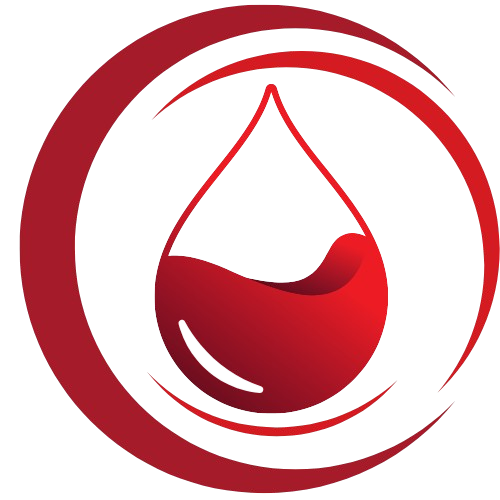

<div align="center">
  
  
  # 🩸 Ehiaaa Front
  ### منصة إحياء للتبرع بالدم - الواجهة الأمامية
  
  *A modern blood donation platform connecting donors with hospitals and blood banks*

[](https://nextjs.org/)
[](https://www.typescriptlang.org/)
[](https://reactjs.org/)
[](https://tailwindcss.com/)
[](https://zustand-demo.pmnd.rs/)

[](https://opensource.org/licenses/MIT)
[](http://makeapullrequest.com)
[](https://github.com/your-username/ehiaaa-front/graphs/commit-activity)

</div>

---

## 🌟 Overview

**Ehiaaa Front** is a modern, responsive frontend application for the Ehiaaa blood donation platform. Built with Next.js 14+ and TypeScript, it provides a seamless experience for blood donors, hospitals, and blood banks to connect and save lives.

### 🎯 Key Features

- 🩸 **Donor Registration** - Complete donor profile with blood type and medical history
- 🏥 **Hospital & Blood Bank Management** - Institutional registration and verification
- 🔐 **Secure Authentication** - Cookie-based auth with JWT tokens
- 👨‍💼 **Admin Dashboard** - Comprehensive user management and approval system
- 📱 **Responsive Design** - Works perfectly on all devices
- 🌙 **Dark Mode** - Beautiful dark/light theme toggle
- 🌍 **RTL Support** - Full Arabic language support
- 📊 **Real-time Updates** - Live data with React Query
- 🎨 **Modern UI** - Built with ShadCN/UI and Tailwind CSS

---

## 🛠️ Tech Stack

### **Frontend Framework**

- **Next.js 14+** - React framework with App Router
- **TypeScript** - Type-safe development
- **React 18** - Latest React features

### **Styling & UI**

- **Tailwind CSS** - Utility-first CSS framework
- **ShadCN/UI** - Beautiful, accessible components
- **Lucide React** - Modern icon library
- **Class Variance Authority (CVA)** - Component styling utilities

### **State Management**

- **Zustand** - Lightweight state management
- **TanStack Query (React Query)** - Server state management
- **React Hook Form** - Form state management

### **HTTP & API**

- **Axios** - HTTP client with interceptors
- **Zod** - TypeScript schema validation
- **React Query** - Data fetching and caching

### **Development Tools**

- **ESLint** - Code linting
- **Prettier** - Code formatting
- **TypeScript** - Static type checking
- **PostCSS** - CSS processing

### **Build & Deployment**

- **Next.js Build** - Optimized production builds
- **Bun** - Fast package manager and runtime

---

## 🚀 Getting Started

### Prerequisites

- **Node.js** 18+ or **Bun** latest
- **Git** for version control

### Installation

1. **Clone the repository**

   ```bash
   git clone https://github.com/your-username/ehiaaa-front.git
   cd ehiaaa-front
   ```

2. **Install dependencies**

   ```bash
   # Using bun (recommended)
   bun install

   # Or using npm
   npm install
   ```

3. **Environment setup**

   ```bash
   cp .env.example .env.local
   ```

   Edit `.env.local` with your configuration:

   ```env
   NEXT_PUBLIC_API_URL=http://192.168.1.20:3000
   NEXT_PUBLIC_APP_URL=http://localhost:3200
   ```

4. **Start development server**

   ```bash
   bun dev
   # or
   npm run dev
   ```

5. **Open your browser**

   Navigate to [http://localhost:3200](http://localhost:3200)

---

## 📁 Project Structure

```
src/
├── app/                     # Next.js App Router
│   ├── (auth)/             # Authentication routes
│   │   ├── login/          # Login page
│   │   └── register/       # Registration pages
│   ├── admin/              # Admin dashboard
│   │   └── users/          # User management
│   ├── dashboard/          # User dashboard
│   ├── layout.tsx          # Root layout
│   └── page.tsx            # Home page
├── components/             # React components
│   ├── admin/              # Admin-specific components
│   ├── auth/               # Authentication components
│   ├── registration/       # Registration forms
│   ├── ui/                 # ShadCN UI components
│   └── layout/             # Layout components
├── hooks/                  # Custom React hooks
│   ├── useAuth.ts          # Authentication hook
│   └── useInitSession.ts   # Session initialization
├── lib/                    # Utility libraries
│   ├── api.ts              # API client
│   ├── axios.ts            # Axios configuration
│   ├── utils.ts            # Common utilities
│   └── validations.ts      # Form validations
├── store/                  # State management
│   └── auth.ts             # Authentication store
├── types/                  # TypeScript definitions
│   ├── auth.ts             # Auth types
│   ├── donor.ts            # Donor types
│   ├── hospital.ts         # Hospital types
│   └── user.ts             # User types
└── middleware.ts           # Next.js middleware
```

---

## 🔐 Authentication Flow

1. **Login Process**

   - User submits email/password
   - Backend validates and returns JWT tokens
   - HTTP-only secure cookies are set
   - User is redirected to dashboard

2. **Token Management**

   - Access token expires in 15 minutes
   - Refresh token expires in 7 days
   - Automatic refresh on API calls
   - Secure logout clears all tokens

3. **Route Protection**
   - Server-side middleware protection
   - Client-side auth guards
   - Role-based access control

---

## 🏥 User Types & Features

### 🩸 **Blood Donors**

- Personal information management
- Blood type and medical history
- Donation tracking and history
- Appointment scheduling
- Donation certificates

### 🏥 **Hospitals**

- Institution profile management
- Blood request management
- Inventory tracking
- Donor search and matching
- Request history and analytics

### 🏦 **Blood Banks**

- Blood inventory management
- Donor coordination
- Hospital supply management
- Quality control tracking
- Storage and expiry management

### 👨‍💼 **Administrators**

- User approval and verification
- System monitoring and analytics
- Content management
- Report generation
- Platform configuration

---

## 🌐 API Integration

### Base URL

```
Production: https://api.ehiaaa.com
Development: http://192.168.1.20:3000
```

### Key Endpoints

#### Authentication

- `POST /auth/login` - User login
- `POST /auth/refresh` - Token refresh
- `POST /auth/logout` - User logout
- `GET /auth/me` - Current user info

#### Registration

- `POST /registration/donor` - Donor registration
- `POST /registration/hospital` - Hospital/Blood bank registration

#### Users

- `GET /users` - Get users list (admin)
- `GET /users/:id` - Get user details
- `PUT /users/:id/status` - Update user status
- `DELETE /users/:id` - Delete user

#### Data

- `GET /governorates` - Get governorates
- `GET /cities` - Get cities

---

## 🎨 UI Components

Built with **ShadCN/UI** for consistent, accessible design:

- **Form Components** - Input, Select, Textarea, Checkbox
- **Data Display** - Table, Card, Badge, Avatar
- **Navigation** - Breadcrumb, Tabs, Pagination
- **Feedback** - Alert, Toast, Dialog, Loading
- **Layout** - Container, Grid, Flex utilities

---

## 📱 Responsive Design

- **Mobile First** - Optimized for mobile devices
- **Tablet Support** - Perfect tablet experience
- **Desktop Ready** - Full desktop functionality
- **Print Friendly** - Optimized print styles

---

## 🌙 Theme Support

- **Light Mode** - Clean, professional appearance
- **Dark Mode** - Easy on the eyes
- **System Sync** - Follows OS preference
- **Persistent** - Remembers user choice

---

## 🧪 Testing

```bash
# Run all tests
bun test

# Run tests in watch mode
bun test:watch

# Run test coverage
bun test:coverage
```

---

## 🚀 Deployment

### Build for Production

```bash
# Create optimized build
bun run build

# Start production server
bun start
```

### Environment Variables

Required environment variables for production:

```env
NEXT_PUBLIC_API_URL=https://api.ehiaaa.com
NEXT_PUBLIC_APP_URL=https://ehiaaa.com
NODE_ENV=production
```

---

## 🤝 Contributing

We welcome contributions! Please see our [Contributing Guidelines](CONTRIBUTING.md) for details.

### Development Workflow

1. Fork the repository
2. Create a feature branch (`git checkout -b feature/amazing-feature`)
3. Commit your changes (`git commit -m 'Add amazing feature'`)
4. Push to the branch (`git push origin feature/amazing-feature`)
5. Open a Pull Request

### Code Style

- Use **TypeScript** for all new code
- Follow **ESLint** and **Prettier** configurations
- Write **meaningful commit messages**
- Add **tests** for new features

---

## 📄 License

This project is licensed under the **MIT License** - see the [LICENSE](LICENSE) file for details.

---

## 👥 Team

- **Frontend Team** - React/Next.js development
- **Backend Team** - NestJS API development
- **UI/UX Team** - Design and user experience
- **QA Team** - Testing and quality assurance

---

## 📞 Support

- **Email**: support@ehiaaa.com
- **Documentation**: [docs.ehiaaa.com](https://docs.ehiaaa.com)
- **Issues**: [GitHub Issues](https://github.com/your-username/ehiaaa-front/issues)

---

<div align="center">
  <p><strong>Made with ❤️ for saving lives through blood donation</strong></p>
  <p>🩸 <em>"Every drop counts, every life matters"</em> 🩸</p>
</div>
